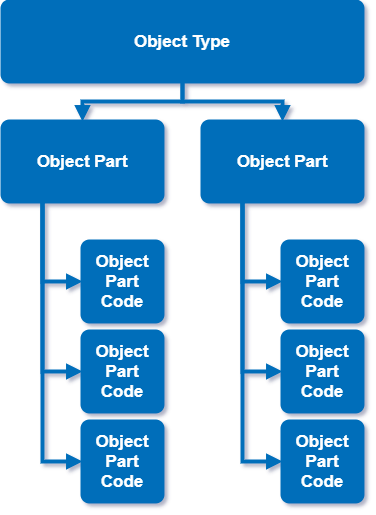

## Field Name Definitions

K2Q FRACAS has been designed with generic field names to accommodate most industry applications and allow you to start using the software right away with minimal setup. This section explains what each field name is used for, and offers some industry specific suggestions. However, it is possible to apply templates within K2Q to change the field labels seen on the screen if required.

## Object Type, Object Part, Object Part Code

|Field Name|Description|
|---|---|
|Object Type|The 'thing' the incident is concerning|
|Object Part|A sub-part of the 'thing' where a problem has been identified|
|Object Part Code|A problem code that is associated to an Object Part|

:::tip Typical Usage Example

**Object Type** could refer to a Product, Part or Process. For this example we will use an *"electronic product"*. An **Object Part** related to this could be a *"power supply"*. The power supply has a fault so the **Object Part Code** could be *"No 12V output"*.

:::